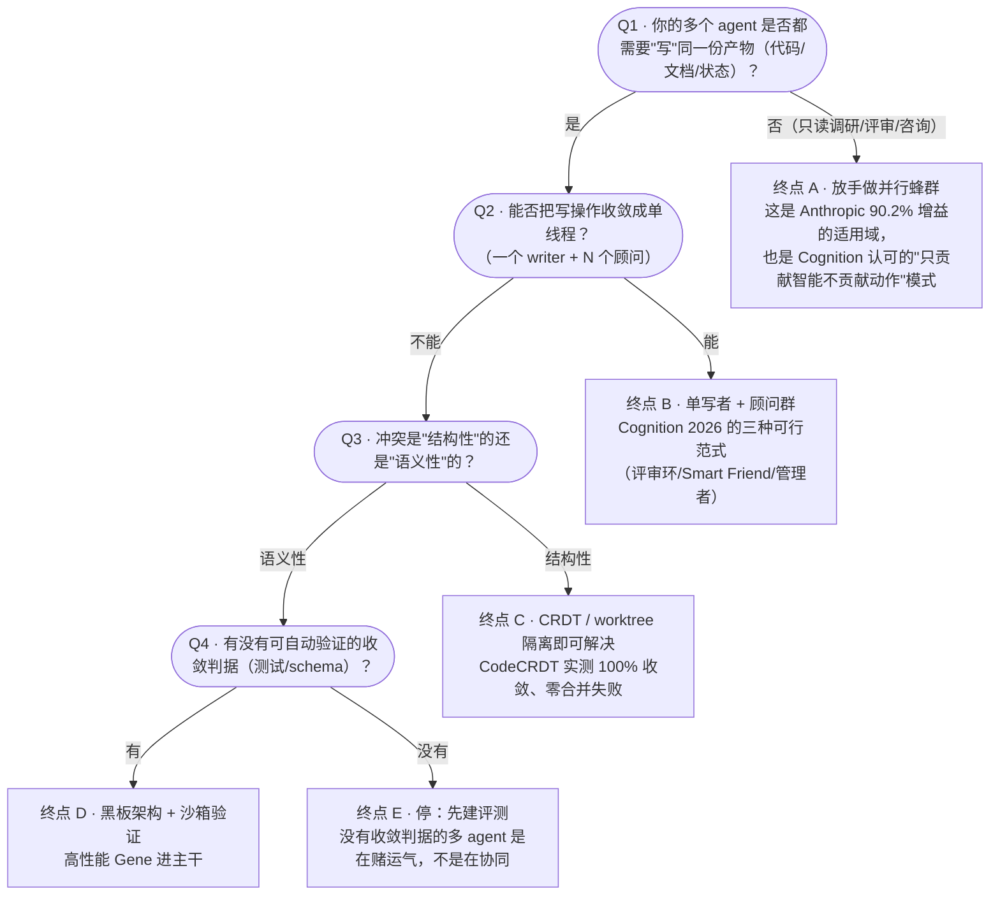

# 多智能体蜂群协同：开源全景与深度调研

## 执行摘要 · Executive Summary

这份调研要回答的不是「多智能体好不好」，而是：**2026 年 9 月，一个四天三晚的黑客松队伍该在多智能体协同的哪个位置下注。**

**单体与蜂群的争论已经结束，但结束方式和多数人以为的不同。** Cognition 2026 年 4 月已改口——多智能体「在写操作保持单线程、附加 agent 只贡献智能而不贡献动作时效果最好」[16]；而 Anthropic 原文本就写着「需要所有 agent 共享同一上下文、或 agent 间依赖很多的领域，目前不适合」[3]。两边说的从来不是同一类任务。真正的分界线不是 agent 数量，是**谁有写权限**。

**最硬的反面证据不是 MAST，是方法论批评。** MAST 实测七个主流框架失败率 41%–86.7%[9]。但 2026 年有三篇更致命：等 thinking token 预算下单 agent 持续追平或超过多智能体[19]；自动生成的多智能体架构贵 10 倍还输给 CoT-Self-Consistency[21]；十篇近期协同架构论文中有七篇的头条效应低于 ±15 个百分点的噪声地板[23]。叠加 Anthropic 自己的「token 用量单独解释 80% 性能方差」[2]，问题变得尖锐：**多智能体是在协同，还是只是在合法地多花 token？**

**因此真正开放的前沿是「每 token 协同收益」。** 这个方向已有可验证落点：相位调度省 27.3% token 而性能仅降 2.1 个百分点[25]；多角色压进单模型达到多智能体同等性能而 token 降 20 倍[33]。另一面，协同确实有真实增益——25000 任务、4 至 256 agent 的实验显示协议间质量差达 44%（Cohen's d=1.86）[13]。**协同协议的选择，比 agent 数量和模型选择都更决定成败。**

**可观测性是最真实、也最适合切入的空白。** OpenTelemetry 的 GenAI 语义约定全部仍是 Development 状态[41]，agent-to-agent 因果关联的三份提案至今全部 open[44][45]。失败归因更刺眼：最好的自动方法只有 53.5% 能指出是哪个 agent 的责任，定位到具体步骤只有 14.2%[46]。**我们能让一群 agent 跑起来，但看不见它们，出事了也说不清是谁的错。**

**建议**：不做又一个多智能体框架。基于已有的 Yoda harness，做一个**可观测、可归因、按 token 效率计费的蜂群协同层**，让「协同是否真的产生增益」第一次变成屏幕上能看见、能量化、能当场证伪的东西。它同时踩中赛道的五个评判维度与文献公认的空白。

## 导言 · Introduction

### 决策背景

这份调研服务于一个具体决定。2026 年 9 月 21 日至 24 日，EvoMap 主办的进化酒馆 Agent 黑客松第四届（EvoTavern 4th）在深圳宝安 BREWTOWN 举行，四天三晚，十万现金奖池。本队已通过审核成为正式参赛选手，报名时选定主赛道 **SECTION 9 | 多 Agent 蜂群协作**（赛道描述为「多 Agent 编排、角色分工、通信协议、冲突解决与协同执行」），第二赛道 GHOST NETWORK | 原生 Agent。队伍规模 3 至 5 人，其中可投入前端可视化的人力最多 1 人。

有一处公开信息不一致需要说明：活动推文标题为「5 大赛道」，而入选邮件正文只列出四条（SHELL FORGE 具身智能硬件、NEW LIFE AI 游戏与交互世界、GHOST NETWORK 原生 Agent、SECTION 9 多 Agent 蜂群协作）。差额可能是全场冠军赛道。本报告以邮件所列赛道描述为准。

已有资产是 Yoda——一个 Apache 2.0 的 Electron agent harness，统一编排 Claude Code、Codex、Gemini 等 32 种 coding agent 客户端，支持 normal / brainstorm / compare / review / team 五种运行模式，每任务一个 git worktree 隔离，内置 MCP 配置适配，本地 SQLite 存状态。这个起点比绝大多数参赛队伍靠前，但它目前解决的是「多个 agent 各自干活互不干扰」，不是「多个 agent 协同完成同一件事」。

### 方法

采用 ultradeep 模式的八阶段流程。检索工具为 WebSearch 与 WebFetch；仓库事实一律通过 GitHub REST API 现场拉取，检索日期统一记为 2026-09-15，不采信文章中的二手 star 数。检索期间 api.github.com 多次超时，统一加最多 5 次重试。

检索分四个并行分支展开：学术前沿与失败模式、通信协议层、可观测与评测、实时可视化方案。三个分支曾因连接中断提前终止，通过续跑恢复了其已核实的结果；每个分支被要求返回「claim + 原文引用 + URL + 置信度」的结构化证据，而非自由文本，以免合并时产生转述漂移。

最终 67 个来源、134 条证据整理成结构化台账，仓库层面的可复用判断另存一份开源方案清单（原始台账未随网站发布）。

### 假设与边界

本报告作了几个会影响结论的假设，明确列出以便证伪：

把 token 效率当作一等约束而不是事后优化，这个判断来自赛前讨论形成的共识，也被 Anthropic 的 80% 方差数据佐证[2]；如果评委更看重绝对能力而非效率，本报告的推荐方向需要调整权重。

假设舞台演示需要在 4 天内由 1 人完成，因此可视化选型强烈偏向「开箱即用 + 视觉冲击力」，牺牲了可定制性。

不覆盖的范围：具身智能与机器人多体协同（属 SHELL FORGE 赛道）、多智能体强化学习（MARL）的经典理论、以及 agent 安全与对抗攻击。这些与赛道相关但不是决策变量。

---

## Decision Guide

> 决策指南 —— 把不可妥协的硬约束排在前面的分支流程。

黑客松只有四天，选错方向的代价是不可逆的。下面这组分支把不可妥协的硬约束排在前面——它们能直接作废一个选项，无论其它维度多好看。

横切约束（任何终点都必须满足，否则回到起点）：

- ✗ 无法归因失败到具体 agent 与步骤 → 不可上生产（自动归因当前仅 53.5%/14.2%）
- ✗ 无法度量每 token 协同收益 → 无法证明架构必要性（token 解释 80% 方差）

### Outcome Map

以下把流程图的每一个终点用文字复述一遍，便于在没有渲染环境时直接使用。

**终点 A（推荐）— 并行只读蜂群。** 当多个 agent 只做检索、调研、评审、给建议，不直接产出最终产物时，放开并行。这是 Anthropic 报告 90.2% 增益的适用域[1]，也是 Cognition 唯一从一开始就认可的多智能体形态[15]。**注意成本：约为单次对话的 15 倍 token**[3]。

【手工川注：某些场景是最好的解决方案】

**终点 B（推荐）— 单写者加顾问群。** 写操作收敛到一个 agent，其余 agent 只输出判断。Cognition 2026 年给出三种已验证可行的范式：代码评审环（Devin Review 平均每个 PR 抓 2 个 bug，其中约 58% 为严重级）、Smart Friend（小模型主导、按需咨询大模型）、管理者-子 agent 委派[16][17]。一个反直觉的实现细节：**评审 agent 用完全干净的上下文效果最好**，「我们发现编码 agent 和评审 agent 事先不共享任何上下文时效果最佳」[18]——这与 Cognition 自己 2025 年「必须共享完整 trace」的原则形成张力，值得在演示中拿出来讲。

【手工川注：场景应用最广泛、最 robust 】

**终点 C（推荐）— 结构性冲突用 CRDT 或 worktree 隔离。** 如果冲突本质是「两个 agent 同时改同一个文件」，这是已解决问题。CodeCRDT 在 600 次试验里做到 100% 收敛、零合并失败[29]。Yoda 现有的每任务 git worktree 隔离已经覆盖了这一层。

【手工川注：值得分析什么时候使用 CRDT，我以为只在某些笔记软件里才会用它】

**终点 D（推荐）— 语义性冲突用黑板架构加沙箱验证。** 如果冲突是「两个 agent 对同一件事做了相互矛盾的判断」，CRDT 帮不上忙——CodeCRDT 同一实验里语义冲突率仍有 5%–10%[30]。可行路径是黑板：**中心 agent 把请求贴到共享黑板，有能力的 agent 自愿认领，结果经验证后才进主干**。这条路线在 2025 至 2026 年有多份实证，其中数据科学信息发现场景报告了端到端成功率 13%–57% 的相对提升[31]。

【手工川注：黑板模式有点意思啊，但什么叫「有能力的 agent」？】

**终点 E（停止 / 前置条件）— 停下来先建评测。** 这是最容易被跳过、也最该被尊重的终点。如果一个多 agent 系统没有任何可自动验证的收敛判据，你无法区分它是在协同还是在碰运气——这正是十篇里七篇栽在噪声地板上的原因[23]。

【手工川注：自动验收前置，业界主流做法了，但对大部分 vibe coder 来说还很陌生，甚至包括我自己】

**两条横切否决线（拒绝条件）。** 其一，无法把失败归因到具体 agent 和步骤的系统不应上生产，这不是苛求，而是因为当前最好的自动归因方法也只有 53.5% 的 agent 级准确率和 14.2% 的步骤级准确率[46]。其二，无法度量每 token 协同收益的架构，无法证明自己的必要性——当 token 用量单独解释 80% 的性能方差时[2]，任何不控制 token 的对比都不成立。

---

## 核心分析 · Main Analysis

### 一、争论已经移位：分界线是写权限，不是 agent 数量

关于多智能体的公共讨论，一年多来一直停在 2025 年 6 月那组巧合上：6 月 12 日 Cognition 的 Walden Yan 发表《Don't Build Multi-Agents》，大约二十四小时后 Anthropic 发布《How we built our multi-agent research system》。一个说别建，一个说我们建了而且效果好 90.2%。这组对立被无数文章引用，也被无数人当成「这个领域还没想清楚」的证据。

但把两份原文并排读完，会发现它们从来没有真正对立过。

Cognition 的论证是机制性的，落在两条上下文工程原则：「共享上下文，而且要共享完整的 agent trace，不只是单条消息」，以及「动作携带隐含决策，而相互冲突的决策导致糟糕结果」[10][11]。他用的例子是做一个 Flappy Bird 克隆：子 agent 1「误解了子任务，开始造一个看起来像超级马里奥的背景」，子 agent 2「给了你一只鸟，但它不像游戏素材，动起来也完全不是 Flappy Bird 那只」[12]，最后的汇总 agent 无力调和这两处错位。注意这个例子的结构——两个子 agent 都在**产出最终产物**，而且它们的产出必须互相咬合。

Anthropic 的适用域恰好排除了这种情况。原文写着，多智能体系统「擅长那些涉及重度并行化、信息量超出单个上下文窗口、需要对接大量复杂工具的高价值任务」[5]，紧接着是一句常被忽略的限定：「某些需要所有 agent 共享同一上下文、或 agent 之间存在很多依赖的领域，目前并不适合多智能体系统」[3]。更直接的是这一句——「大多数编码任务里可真正并行的子任务比研究少得多，而且 LLM agent 目前还不擅长实时协调和委派给其它 agent」[4]。

Anthropic 亲口把编码排除在外，而 Cognition 的产品 Devin 正是编码 agent。两边说的是不同任务类型。

真正让这件事尘埃落定的，是 Cognition 自己在 2026 年 4 月 22 日发的后续文章《Multi-Agents: What's Actually Working》。立场变了，但不是推翻，是收窄：「多智能体系统在今天效果最好的情况是，写操作保持单线程，而额外的 agent 贡献的是智能而不是动作」[16]。他们给出三种已在生产中验证的范式——代码评审环、Smart Friend（小模型主导、按需咨询大模型）、管理者-子 agent 委派。量化结果是 Devin Review 平均每个 PR 抓出 2 个 bug，其中约 58% 属于严重级（逻辑错误、遗漏边界情况、安全漏洞）[17]。

所以分界线不在 agent 数量，在**写权限的拓扑**。多个 agent 并行读、并行想、并行评判，是已被双方认可的安全区；多个 agent 并行写同一份产物，是已被双方认可的雷区。中间地带——多个 agent 写不同产物但产物之间有语义依赖——才是真正未解的部分，也正是 SECTION 9 赛道描述里「冲突解决与协同执行」指向的地方。

这里还埋着一个值得在舞台上讲的反转。Cognition 2026 年的文章里有一处与他们 2025 年第一条原则直接冲突的发现：评审 agent 表现最好的配置是**完全不共享上下文**——「我们发现这个技术在编码 agent 和评审 agent 事先不共享任何上下文时效果最好」[18]。理由是让评审者避开 context rot、独立于实现进行推理。一年前他们说「必须共享完整 trace」，一年后他们说「评审者最好什么都别看」。这不是自相矛盾，是同一个原则在不同角色上的不同投影：**需要接力的角色要共享上下文，需要证伪的角色要隔离上下文**。这个区分在现有框架里几乎没有被显式建模。

### 二、失败不是随机的，但「成功」也可能不是真的

如果说第一节讲的是边界，这一节讲的是地基有多松。

最广为引用的证据是 MAST（Multi-Agent System Failure Taxonomy）。UC Berkeley 团队用扎根理论分析了 150 余条多 agent 执行轨迹（每条平均超过 15000 行文本），六名专家标注者迭代到高度一致（kappa = 0.88），最终归纳出 14 种失败模式、聚为 3 大类：系统设计问题、agent 间失配、任务验证[8][6]。配套的 MAST-Data 覆盖 7 个主流框架的 1600 余条标注轨迹。实测结论是这 7 个 SOTA 开源多智能体框架的失败率在 **41% 到 86.7%** 之间[9]。

论文开篇那句话比失败率更重要：「尽管业界对多智能体 LLM 系统热情高涨，它们在流行 benchmark 上的性能增益往往极小」[7]，而且「相比单 agent 框架、甚至相比 best-of-N 采样这种简单基线，增益通常仍然很小」[59]。

MAST 也给了正面的东西：结构性修复是有效的。让 ChatDev 的 CEO 角色拥有最终决定权，整体任务成功率提升 9.4%；加入一个高层任务目标验证步骤，在 ProgramDev 上提升 15.6%[47]。这两个数字很关键——它们说明**协同失败大多是工程问题，不是模型能力问题**。

但 2026 年出现的三篇论文，杀伤力比 MAST 更大，因为它们攻击的不是实现，是证据本身。

第一篇把算力控住了。Dat Tran 与 Douwe Kiela 的实验发现，「当推理 token 保持恒定时，单 agent 系统在多跳推理任务上持续追平或超过多智能体系统」[19]，论文的解释是「在固定推理 token 预算和完美上下文利用下，单 agent 系统的信息效率更高」[20]。此前报告的多智能体优势，很大程度来自未被控制的算力差异。

第二篇把成本摆上桌。《The Illusion of Multi-Agent Advantage》显示，自动生成的多智能体架构「在贵至 10 倍的情况下仍持续输给 CoT-Self-Consistency」[21]。但这篇论文也给了边界条件，这个边界条件对我们很重要：在专门设计了显式任务分解、上下文隔离和并行潜力的诊断数据集上，「专家手工设计的 MAS 在原始性能和成本效率两方面都持续优于自动生成的架构」[22]。**失败的是自动架构搜索这条路径，不是多智能体本身。**

第三篇最狠，攻击的是整个文献的统计有效性。同模型配对复现实验测出多智能体协同的噪声地板可达 ±15 个百分点，而「十篇近期多智能体协同架构论文中有七篇的头条效应低于这一地板，还有一篇落在包络之内；它们能否经受同模型配对复现，在其原始设定下从构造上就是未经检验的」[23]。

把这三篇和 Anthropic 自己的数据放在一起，会得到一个很不舒服的结论。Anthropic 在 BrowseComp 上的方差分析显示，「token 用量本身就解释了 80% 的方差，工具调用次数和模型选择是另外两个解释因子」[2]。而多智能体系统的 token 用量约为普通对话的 15 倍（单 agent 约为 4 倍）[3]。

也就是说：**当前大多数「多智能体优于单智能体」的证据，都没有排除「它只是花了更多 token」这个更简单的解释。**

这不是说多智能体没用。这是说，这个领域缺的不是又一个框架，是**一把能把协同增益和 token 增益分开的尺子**。这把尺子目前不存在。谁做出来，谁就占住了这个赛道最硬的位置。

值得一提的是，金融领域的一篇 2026 综述把这件事讲得最直白。它提出「协同优先假说」（Coordination Primacy Hypothesis）——agent 间协同协议的设计是决策质量的首要驱动因素，影响常大于模型规模——但作者非常克制地声明，这是「一个可证伪的研究假说，由分层结构性证据支持，而非一个经验证实的结论；它的确定性验证需要这个领域目前还不存在的评测基础设施」[38]。同一篇论文还记录了五类会让报告收益正负号反转的评测缺陷[39]。

### 三、协同机制的四条真实路线

抛开框架营销，2025 至 2026 年真正有实证支撑的协同机制其实只有四类。它们都不新——三类是经典分布式系统和经典 AI 的东西被重新捡起来——但在 LLM agent 上的重新验证是新的。

#### 黑板架构：最被低估的一条

黑板（blackboard）是 1970 年代的老东西：所有参与者读写同一块共享板，谁有能力解决当前问题谁就接手，不需要中心调度者知道每个人会什么。

它在 2025 至 2026 年被重新拿出来用在 LLM agent 上，而且实证结果不错。Google 与 UMass 团队的做法是「中心 agent 把请求贴到共享黑板上，自治的下级 agent——各自负责数据湖的一个分区或负责从网络检索——根据自身能力自愿响应」[27]，在 KramaBench、改造版 DSBench 和改造版 DA-Code 三个基准上，「端到端成功率相对最优基线提升 13% 到 57%，数据发现 F1 最高提升 9%」[28]。另一项工作在常识、推理和数学数据集上报告黑板架构取得最佳平均性能且 token 消耗更少[32]。

黑板架构的结构性优点，正好对上多智能体的两个核心痛点：**中心协调者不需要知道每个 agent 的专长**（解决角色分工的脆弱性），以及**所有交互天然留在一块共享的、可审计的板上**（解决可观测性）。这一点后面还会回来。

#### 共识主动性：从信息素到自组织

Stigmergy（共识主动性）是蚂蚁那套——不直接通信，通过修改环境留下痕迹来间接协调。

SwarmSys 把它做进了 LLM agent：Explorer / Worker / Validator 三角色循环，配「自适应 agent 与事件画像、基于嵌入的概率匹配、以及受信息素启发的强化机制，支持动态任务分配和无需全局监督的自组织收敛」[34]。MIT 的 SwarmWorld 走得更远，让没有预设角色的同质 LLM agent 通过修改共享空间环境自组织出技术演化社会，结论是「仅靠物理 stigmergy 就足以支撑有能力的社会，而交互带来的是持久的技术生态，而非普遍更优的个体发明」[35]。

但这条路线有一个必须正视的硬约束。有人把 Boids 和蚁群优化分别用经典方式和 LLM 方式实现做对比，结果是「我们基于 LLM 的 Boids 模拟所需计算时间约为其经典对应版本的 300 倍」[36]。**把 swarm 算法直接搬到 LLM 上，代价高得离谱。** 可行的做法是分层：用经典 swarm 算法做调度和拓扑决策（便宜、确定性强），只在需要语义判断的节点上调 LLM。

#### 契约网与拍卖：把通信当稀缺资源

Contract Net Protocol 也是老东西（1980 年代），2026 年被重新用在 LLM agent 通信基础设施上。LLM-X 提供「支持能力协商与契约网式协同的类型化消息协议」，并给出「首个规模化 LLM 多智能体协商的实证评测」[37]，在 5/9/12 个 agent、2 小时与 12 小时长跑设定下发现更严格的协商策略提升鲁棒性与公平性，但增加延迟和消息量。

更有意思的是拍卖路线。DALA 的做法是把 **agent 间通信带宽本身当作稀缺可交易资源**，用集中式拍卖让 agent 竞价发言权，结果是「在七个高难推理基准上达到新的 SOTA，包括 MMLU 84.32% 和 HumanEval pass@1 91.21%。值得注意的是这是在极高效率下实现的，即我们的 DALA 只用了 625 万 token」[40]。

这条路线之所以重要，是因为它和第二节的核心矛盾直接咬合：**如果 token 是稀缺资源，那么让 agent 为发言权付费，是把 token 效率直接编码进协同机制的最自然方式。**

#### 拓扑优化与自组织：结构本身是可学的

最后一条是把协同拓扑当成可优化对象。GPTSwarm「用策略梯度算法优化 agent 节点之间的连接」[24]，DyLAN 动态激活 agent 组合，AgentPrune 剪掉冗余边。

但 2026 年最重磅的结果来自反方向。一项 25000 任务的计算实验，跨 8 个模型、4 到 256 个 agent、8 种从外部强加的层级到涌现自组织的协同协议，得出的结论是：

- 允许自主性的混合协议（Sequential）比中心化协调高出 14%（p<0.001）[13]
- 协议之间的质量差达 44%（Cohen's d=1.86, p<0.0001）[13]
- 系统亚线性扩展到 256 agent 而质量不退化（p=0.61），从仅 8 个 agent 产生出 5006 种不同角色[13]
- 开源模型达到闭源模型 95% 的质量而成本低 24 倍[13]

唯一的限定是：「能力低于某个阈值的模型仍然受益于刚性结构」[14]。

44% 的协议间质量差是个很大的数字——它意味着**协同协议的选择可能比模型选择更决定结果**。这与前面「token 解释 80% 方差」形成了一组真实的张力：token 是最强的单一解释变量，但在 token 之外，协议是第二强的杠杆，而且它几乎免费。

顺带说一句角色分工。文献结论是分裂的：一篇 2026 年的工作直接指出关于专家 persona 的效用「既有报告在特定领域带来增益的，也有发现对通用效用近乎零甚至负面影响的」[48]。而 MoRe 把多重专业化压进单个 agent 的可组合 steering vector，做到「与多智能体系统性能持平而 token 成本降低 20 倍」[33]。真正被验证有效的不是「角色标签」，是**结构化的、可追责的交接**——有研究在 Planner→Executor→Critic 流水线上发现「在 agent 之间加入结构化、可追责的交接显著提升准确率并防止了简单流水线中常见的失败」，并用 repair rate 和 harm rate 量化了各模型的角色特定优劣[49]。

**换句话说：值钱的是交接协议，不是角色人设。**

### 四、框架层：2026 年的一次静默洗牌

把框架层的真实状态摊开看，会发现一件媒体没怎么讲的事：**2026 年上半年，多智能体框架层发生了一次相当彻底的洗牌，而 star 数完全没反映出来。**

所有数字均为 2026-09-15 通过 GitHub REST API 现场拉取。

| 项目 | Stars | 最后 push | 许可证 | 状态判断 |
|---|---:|---|---|---|
| [Dify](https://github.com/langgenius/dify) | 155,794 | 2026-09-15 | NOASSERTION | 活跃，但许可证非标准 OSI |
| [OpenHands](https://github.com/OpenHands/OpenHands) | 87,965 | 2026-09-15 | MIT | 活跃（组织已从 All-Hands-AI 改名） |
| [MetaGPT](https://github.com/FoundationAgents/MetaGPT) | 70,399 | **2026-01-21** | MIT | **近 8 个月无 push** |
| [AutoGen](https://github.com/microsoft/autogen) | 60,989 | **2026-04-15** | **CC-BY-4.0** | **已进入维护模式** |
| [CrewAI](https://github.com/crewAIInc/crewAI) | 58,579 | 2026-09-14 | MIT | 活跃 |
| [Flowise](https://github.com/FlowiseAI/Flowise) | 55,459 | 2026-08-13 | NOASSERTION | **仓库已归档** |
| [Agno](https://github.com/agno-agi/agno) | 42,180 | 2026-09-15 | Apache-2.0 | 活跃 |
| [LangGraph](https://github.com/langchain-ai/langgraph) | 41,682 | 2026-09-14 | MIT | 活跃 |
| [ChatDev](https://github.com/OpenBMB/ChatDev) | 34,305 | 2026-07-24 | Apache-2.0 | 放缓 |
| [OpenAI Agents SDK](https://github.com/openai/openai-agents-python) | 29,448 | 2026-09-15 | MIT | 活跃 |
| [Mastra](https://github.com/mastra-ai/mastra) | 28,052 | 2026-09-15 | NOASSERTION | 活跃（TS 生态） |
| [OpenAI Swarm](https://github.com/openai/swarm) | 21,981 | **2026-04-15** | MIT | **已被 Agents SDK 取代** |
| [Coze Studio](https://github.com/coze-dev/coze-studio) | 21,591 | 2026-07-29 | Apache-2.0 | 放缓 |
| [Google ADK](https://github.com/google/adk-python) | 21,542 | 2026-09-15 | Apache-2.0 | 活跃 |
| [CAMEL](https://github.com/camel-ai/camel) | 17,719 | 2026-09-14 | Apache-2.0 | 活跃 |
| [Microsoft Agent Framework](https://github.com/microsoft/agent-framework) | **13,530** | 2026-09-15 | MIT | **AutoGen + SK 的继任者** |
| [Swarms](https://github.com/kyegomez/swarms) | 7,172 | 2026-09-15 | Apache-2.0 | 活跃但体量小 |

三件事值得单独指出。

**AutoGen 已经退场。** 微软把 AutoGen 与 Semantic Kernel 合并为 Microsoft Agent Framework，2025 年 10 月公开预览，2026 年 2 月 19 日 RC，2026 年 4 月 3 日发 1.0；AutoGen 与 SK 双双进入维护模式——「继续修 bug 和安全补丁，但不再有新功能」[50]。GitHub 上 60,989 颗星和 2026-04-15 的最后 push 并列在一起，正是这次交接的化石。任何 2026 年的框架推荐如果还把 AutoGen 列为首选，说明作者没看过仓库。

**Flowise 已归档。** 55,459 颗星、25,016 个 fork 的项目，`archived` 字段是 true。不能再作为新项目的依赖。

**许可证需要逐个核。** Dify、Flowise、Mastra、Langfuse 的 SPDX 都是 NOASSERTION（GitHub 无法识别为标准 OSI 许可），AutoGen 被识别为 CC-BY-4.0——这是内容许可而非代码许可。如果打算在黑客松作品里直接搬 AutoGen Studio 的前端代码，需要先确认授权边界。

对本队的实际意义是：LangGraph 与 OpenAI Agents SDK 是当前最稳的两个编排底座，Microsoft Agent Framework 值得关注但生态还在迁移中；而 MetaGPT、ChatDev 这类「角色扮演软件公司」范式，既在 MAST 里是被测出高失败率的对象[9]，仓库活跃度也在下降——**它们代表的是上一代思路。**

### 五、协议层：治理收敛了，实现层没有

2025 年常见的说法是「agent 协议正在碎片化」。到 2026 年 9 月，这个说法只对了一半。

**治理层收敛得非常彻底。** 2025 年 12 月 9 日，Linux Foundation 宣布成立 Agentic AI Foundation（AAIF），创始贡献项目包括 Anthropic 的 MCP、Block 的 goose 和 OpenAI 的 AGENTS.md[52]；白金会员是 AWS、Anthropic、Block、Bloomberg、Cloudflare、Google、Microsoft、OpenAI[53]。Anthropic 把 MCP 捐给了这个定向基金[51]。A2A 那边，Google 2025 年 4 月发起，6 月 23 日捐给 Linux Foundation，2026 年 4 月 9 日发布 v1.0 首个稳定规范，支持组织超过 150 家，在 Google、Microsoft、AWS 三大云都有生产部署[55][56]。IBM 的 ACP 已在 2025 年 8 月并入 A2A——「ACP 团队将逐步停止主动开发，并开始把技术与专长直接贡献给 A2A」[57]，`i-am-bee/acp` 仓库现在的 `archived` 是 true。

分工共识也定下来了，有官方表述背书：「A2A 定义 agent 之间如何跨组织边界通信与协调，MCP 定义 agent 如何连接内部工具与数据源」[58]。一句话：**MCP 接工具，A2A 接 agent。**

**但实现层没有收敛，而且这才是会咬人的地方。** 有分析说得很准：「剩下的碎片化在实现层。两个都声称支持 MCP 的系统，可能实现了规范的不同子集、错误处理不同、能力协商行为不一致，并且只在高负载下才暴露出互操作失败」[60]。

还有一个更大的新变量：**MCP 在 2026-07-28 做了一次破坏性重构。** Anthropic 的 David Soria Parra 形容这是「我们对规范做过的最实质的改动，大概是自加入授权机制以来最大的一次」，并且「很多构成 MCP 的东西已经没了」[61]。具体改了什么——协议级 session 被彻底移除，「每个请求可以被独立处理」[62]；官方博客的说法是「MCP 正从一个双向有状态协议转变为一个请求/响应无状态协议」[63]；标准传输只剩 stdio 和 Streamable HTTP，旧的 HTTP+SSE「正式弃用，有一年的过渡期」[64]。Parra 也承认了根因：「原始规范未能正确定义 session 细节应如何保存，导致了复杂问题」[65]。迁移成本不低——「如果你自建了实现，要把它改对需要相当大的工作量」[66]。

这对我们有两个直接含义。其一，如果作品里要用 MCP，必须钉住规范版本，不要假设跨版本兼容。其二，**MCP 现在明确不是 agent 间协作协议**——它的官方定位是「连接 AI 模型到工具、数据和应用的通用标准协议」[54]。SECTION 9 要的「通信协议」这一维，MCP 答不了，A2A 才答得了。

其余玩家的真实体量值得校准。ANP 走 W3C DID 去中心化身份路线，仍在高频更新（2026-09-15 仍有 push），但 1,429 颗星，比 MCP 和 A2A 小一到两个数量级。AGNTCY（Cisco 发起的 Internet of Agents）是企业联盟驱动，四大组件 OASF / Identity / SLIM / Observability 设计完整，但最大的仓库 `oasf` 只有 333 颗星，`dir` 187，`slim` 216——**这是自上而下的基础设施，不是开发者自发采纳的东西。** 组织内还有多个早期组件（acp-spec、acp-sdk、workflow-srv 等）已归档。

反倒是一个不那么被当成「agent 协议」的方向更值得抄：NATS 社区推出了 NATS 原生的 agent 协议，论点很朴素——「在生产规模上，agentic 系统就是披着风衣的分布式系统」[67]，而「大多数团队还在用 HTTP 把它们粘起来，或者把所有东西硬塞进某个厂商的网关或网格里」[68]。它给出的三个原语几乎就是蜂群协同需要的全部：JetStream stream 当 per-agent 邮箱（「发给忙碌或离线 agent 的消息在 stream 上等待，等 agent 空闲时投递」[69]）、work queue 做按角色 anycast（「寻址一个像 reviewer 这样的服务，恰好一个可用实例领走这份工作」[70]）、KV bucket 广播在场态（「每个 agent 发布一个实时状态——idle、working、waiting、offline——加上它的能力，任何对端都可以观察这个 bucket」[71]）。

最后一条：AGENTS.md 已被超过 6 万个开源项目使用[72]，并已由 AAIF 托管[73]。它没有执行语义，但作为 agent 上下文的事实标准，是任何 harness 都该支持的最低成本互操作点。

### 六、可观测性：这个领域最真实的空白

如果只能在这份调研里挑一个「现在做一定不会撞车」的方向，是这个。

**标准层还没有 1.0。** OpenTelemetry 的 GenAI 语义约定定义了 `create_agent`、`invoke_agent`、`plan`、`invoke_workflow`、`execute_tool` 这些操作名[42]，听起来挺完备，但「它们全部被标记为 Development，不是 stable」[41]。2026 年 6 月这套约定还从主 semantic-conventions 仓库拆到了独立的 `semantic-conventions-genai`。

**多 agent 关联是公开承认的未解问题。** OTel 社区自己的 issue 里写着：「我们本质上需要一种记录 agent 调用因果关系的方式（这不总能用 span 层级表达，因为一切都是异步的）」[43]。三份试图解决 agent-to-agent 关联的提案——PR #98、PR #195、PR #447——到 2026 年 9 月全部还是 open 状态。其中 PR #98 把问题讲得最清楚：「今天，当一个 agent 通过框架的类型化 handoff 原语委派给另一个 agent 时，trace 里会出现两个 `invoke_agent` span，在 span 层面看不到任何因果链接」[44]。最新的 PR #447 干脆直接承认了边界：「不暴露调用方自有操作的进程内原生 handoff 仍然是一个采集盲区。本 PR 不从 trace 拓扑推断转移语义」[45]。

A2A 那边同样断裂：「没有标准规范来在 A2A 元数据中传播 trace context 和 session 细节，这使得追踪异步或委派式的多 agent 任务极为困难」[96]。

**产品层各自为政。** Langfuse 走标准 OTel context propagation，「跨服务边界传播 trace ID，所有 span 落进同一条 Langfuse trace」，然后给出「一棵 trace 树、一个图视图、一个挂分数的地方」[74]，并且不绑定 LangGraph——任何框架只要产生非 span/event/generation 类型的 observation，它就按 agentic trace 渲染成图[75]。Phoenix 则用自家的 OpenInference 语义层，为每个 agent 产生带 graph metadata 的 AGENT span。**两家头部开源方案的语义层是分叉的。**

商业格局也在变：Langfuse 于 2026-01-16 被 ClickHouse 收购（官方声明保持开源与可自托管）[76]；Helicone 于 2026-03-03 被 Mintlify 收购并转入维护模式[77]；AgentOps 的最新 release 停在 2025-08-29，明显落后同类。

**最刺眼的数字在失败归因。** 一篇研究直接指出：「LLM 多 agent 系统中的失败归因——识别出对任务失败负责的 agent 和步骤——为系统调试提供关键线索，但仍然探索不足且高度依赖人工」[78]。在 Who&When 数据集（127 个多 agent 系统失败日志）上的实测是：「最好的方法在识别失败负责 agent 上达到 53.5% 准确率，但在定位失败步骤上只有 14.2%，有些方法表现低于随机。即便是 SOTA 推理模型如 OpenAI o1 和 DeepSeek R1，也未能达到实用水平」[46]。

**回放同样是空白。** LangGraph 的 time travel 是真能力，但官方明说「重放是重新执行节点，而不只是读缓存。LLM 调用、API 请求和 interrupt 会再次触发，并可能返回不同结果」[79]——即非确定性重放，而且文档不覆盖多 agent 场景。检索到的三个「agent replay / time travel」开源项目，star 数分别是 14、9、1，fork 全为 0。

把这几条串起来：**我们能让一群 agent 跑起来，但看不清它们之间发生了什么；出了错，有一半以上的概率说不清是谁的错，定位到具体哪一步的概率只有一成四。** 这不是某个工具的缺陷，这是整个领域的地基还没浇。

### 七、评测：九个主流基准，没有一个在测协同

SECTION 9 的赛道描述里有「协同执行」四个字。要证明协同有效，得有尺子。目前的情况是——尺子都在量别的东西。

九个被广泛引用的 agent 基准——SWE-bench（及 Verified）、GAIA、AgentBench、τ-bench 与 τ²-bench、MLE-bench、TheAgentCompany、WebArena、OSWorld——测的都是**最终任务成功率**。多智能体在其中是解法，不是被测对象。你可以用多 agent 去刷 SWE-bench，但榜单不会告诉你增益来自协同还是来自多花的 token。

这个空白被明确承认过。MultiAgentBench 的动机陈述是：「现有 benchmark 要么聚焦单 agent 任务，要么局限于窄领域，无法刻画多 agent 协调与竞争的动态」[80]。

确实有人在补。MultiAgentBench（MARBLE）用里程碑式 KPI 同时衡量任务完成与协作质量，并对比 star / chain / tree / graph 四种协调拓扑。AgentsNet 则更直指要害——它评测的是「多智能体系统在给定网络拓扑下，协同形成问题求解策略、自组织与有效通信的能力」[81]，取材自分布式系统与图论的经典问题，规模做到 100 个 agent，并指出「现有多智能体 benchmark 最多覆盖 2 到 5 个 agent，而 AgentsNet 在规模上实际上是无限的」[83]。它的实测结论也很直白：「一些前沿 LLM 在小网络上已经表现不错，但一旦网络规模扩大就开始下滑」[82]。

但这些都还不是共识标准，而且缺口仍在。2026 年 5 月的 EntCollabBench 指出「现有企业 benchmark 大多评测拥有广泛工具权限的单 agent，而现有多 agent benchmark 很少刻画角色专精、访问控制、有状态业务系统、基于策略的审批这类真实企业约束」[84]。

对黑客松的含义很具体：**没有现成榜单能证明你的协同架构更好。** 但这既是坏消息也是好消息——它意味着一支队伍如果能当场演示一把可信的尺子（同一任务、同一模型、同一 token 预算，单 agent 对比蜂群），这个演示本身就是这个赛道当前最稀缺的东西。

### 八、舞台可视化：一个被普遍高估的规模，和一个被普遍低估的瓶颈

这一节的目标很具体：10 到 200 个 agent 节点、边累积到数千、每秒多次增量更新、4 天内 1 人做出来、大屏上要好看。

先破除一个迷思。关于「多少节点会卡」，网上流传的数据大多引自 `cytoscape/js-graph-lib-comparison`——那个仓库 2016 年就停更了，不该再引用。我找到的唯一有实测曲线的学术来源是 TU Dresden 的 Horak、Kister 与 Dachselt 的工作，方法是「测试我们能显示多少节点，直到浏览器不再能以 60 FPS 流畅平移或重绘当前场景」[85]，测试机是 i7-7500U 核显轻薄本，属于保守下限。

结果有三条反直觉：

- 「SVG 和 Canvas 表现几乎持平，性能下降从约 10,000 个图元开始，而 WebGL 在显示文字元素时略好，在没有文字元素时几乎不受节点数增长影响」[86]——**Canvas 并不天然比 SVG 快**，这一点作者特意点出。
- 「我们的测量显示，三种技术在超过 400 个节点（约 8,000 个图元）后都开始出现性能损失」[87]。400 这个数字比大多数人的直觉低得多。
- 「在没有文字元素时，FPS 不受节点数影响；即使在 400,000 节点（约 800 万图元）的极端设定下，可视化仍以 50 FPS 运行」[88]。

第三条给出了本场景真正的瓶颈：**不是节点数，是文字标签。** 200 个 agent 全程挂名字，会比 200 个 agent 本身贵得多。正确做法是默认不显示标签，hover 或聚焦时才渲染。

按这个框架评估候选方案：

| 方案 | Stars | 渲染 | 200 节点 / 数千边 / 高频更新 | 4 天可交付性 | 判断 |
|---|---:|---|---|---|---|
| [react-force-graph](https://github.com/vasturiano/react-force-graph) | 3,299 | Canvas + WebGL 双路 | 稳 | 高（单组件） | **首选** |
| [3d-force-graph](https://github.com/vasturiano/3d-force-graph) | 6,399 | ThreeJS/WebGL | 稳 | 高 | 冲视觉时用 |
| [sigma.js](https://github.com/jacomyal/sigma.js) + [graphology](https://github.com/graphology/graphology) | 12,164 | WebGL | 稳 | 中（双库） | 稳妥次选 |
| [cosmos.gl](https://github.com/cosmosgl/graph) | 1,269 | 全 GPU | 极稳（百万级） | 中 | 杀鸡用牛刀 |
| [Cytoscape.js](https://github.com/cytoscape/cytoscape.js) | 11,210 | Canvas | 吃力 | 中 | 观感偏学术 |
| [G6](https://github.com/antvis/G6) | 12,294 | 多渲染器 | 可 | 低（API 面大） | 中文文档是唯一优势 |
| [React Flow / xyflow](https://github.com/xyflow/xyflow) | 38,379 | DOM + SVG | **会掉帧** | 高 | 规模不够 |
| [deck.gl](https://github.com/visgl/deck.gl) | 14,591 | WebGL 图层 | **会掉帧** | 中 | 更新模型不匹配 |

两个需要解释的「否」。

**React Flow 的问题不在渲染器，在 React。** 官方文档自己写着「每次对 `nodes` 数组的更新都会触发所有依赖组件的重渲染，即使改动无关」[89]，并且「复杂的 CSS 样式，尤其是涉及动画、阴影或渐变的，会显著影响性能」[90]。后半句尤其致命——**阴影、渐变、动画正是舞台视觉冲击力最常用的手段，而它们和性能在这个库里是直接对冲的。** 再叠加节点是 DOM、边是 SVG，数千条边直接撞上 10,000 图元的天花板。

**deck.gl 的问题最反直觉。** 它静态渲染极强——「大多数基础图层（如 ScatterplotLayer）在多达约 100 万数据项时仍能在平移缩放中流畅保持 60 FPS」[91]。但官方把更新 `data` prop 描述为「一个图层做的最昂贵的操作」[92]，因为要重算 GPU buffer。本场景恰恰是每秒多次增量更新，正踩在它的短板上。

**推荐 react-force-graph 的理由有三个，其中第二个是决定性的。** 一是同一套 API 同时给 2D Canvas 和 3D WebGL，可以先用 2D 保交付、有余力再切 3D 冲视觉，这条退路在四天赛程里很值钱。二是它内置链路粒子动画——**「消息在边上流动」这个本场景最核心的视觉诉求，不需要自己写粒子系统**，这大概省掉一整天。三是节点自定义绘制简单，agent 的 idle / working / blocked / failed 四态换色换形都是小工作量。风险是最后一次 push 停在 2026-02-04，已半年多无更新，但功能面已稳定。

如果只赌视觉，直接上 3d-force-graph（「使用 ThreeJS/WebGL 的 3D 力导向图组件」[93]）配 bloom 后期，大屏效果最炸，代价是调试成本和上面那条文字标签约束必须提前认。

**现成可抄的 agent 可视化实现有三处值得看。** AutoGen Studio 的前端确实用 xyflow 画 agent 图（`package.json` 里有 `"@xyflow/react": "^12.3.5"`[94]），是目前最成熟的 agent 图 UI 实现，但 AutoGen 仓库被 GitHub 识别的许可证是 CC-BY-4.0，搬代码前需确认授权。LangGraph Studio 是死路——仓库返回 404，不开源。最值得留意的反而是 Langfuse 的做法：它的 trace 图**没用任何现成图库**，而是 d3-selection + d3-zoom 自绘、用 elkjs 做布局（`"elkjs": "^0.11.1"`[95]）。这说明生产级 trace 图的胜负手在**布局质量**而非渲染规模——对一个 200 节点的场景，这是个很重要的提示：把时间花在布局和动效上，不要花在追求更大的渲染规模上。

---

## Open-Source Solutions Landscape

> 开源方案全景

完整记录共 34 条，含验证状态与风险标注。下表为决策相关的浓缩视图，所有仓库指标为 2026-09-15 通过 GitHub REST API 现场拉取。

| 项目 | 层 | 已验证机制 | 活跃度 | 许可证 | 取舍 |
|---|---|---|---|---|---|
| [LangGraph](https://github.com/langchain-ai/langgraph) | 编排 | 图状态机 + checkpointer；time travel 重放会重新执行节点 | 2026-09-14 | MIT | reuse |
| [OpenAI Agents SDK](https://github.com/openai/openai-agents-python) | 编排 | typed handoff 转移控制权 | 2026-09-15 | MIT | reuse |
| [Microsoft Agent Framework](https://github.com/microsoft/agent-framework) | 编排 | workflow 显式控制多 agent 路径 | 2026-09-15 | MIT | reference |
| [AutoGen](https://github.com/microsoft/autogen) | 编排 | 会话式交换；Studio 前端用 @xyflow/react | 2026-04-15 | CC-BY-4.0 | reference（已维护模式） |
| [MetaGPT](https://github.com/FoundationAgents/MetaGPT) | 编排 | SOP 编码进角色 | 2026-01-21 | MIT | research_only |
| [Flowise](https://github.com/FlowiseAI/Flowise) | 编排 | 节点图执行器 | 已归档 | NOASSERTION | **reject** |
| [MCP](https://github.com/modelcontextprotocol/modelcontextprotocol) | 协议 | stdio / Streamable HTTP；2026-07-28 起无状态 | 2026-09-14 | NOASSERTION | reuse（钉版本） |
| [A2A](https://github.com/a2aproject/A2A) | 协议 | AgentCard 发现 + 有状态 Task + 三种绑定 | 2026-09-14 | Apache-2.0 | reuse |
| [ACP](https://github.com/i-am-bee/acp) | 协议 | REST 式 agent 通信 | 已归档 | Apache-2.0 | **reject**（并入 A2A） |
| [ANP](https://github.com/agent-network-protocol/AgentNetworkProtocol) | 协议 | did:wba 去中心化身份 | 2026-09-15 | Apache-2.0 | research_only |
| [AGNTCY](https://github.com/agntcy/dir) | 协议 | OASF + Directory + SLIM | 2026-09-15 | Apache-2.0 | research_only |
| [AGENTS.md](https://github.com/agentsmd/agents.md) | 约定 | 仓库根 Markdown，6 万+ 项目采用 | 2026-09-10 | MIT | reuse |
| [NATS](https://github.com/nats-io/nats-server) | 总线 | JetStream 邮箱 + work queue anycast + KV 在场态 | 2026-09-14 | Apache-2.0 | **reuse** |
| [Langfuse](https://github.com/langfuse/langfuse) | 可观测 | OTel context propagation 合并 trace；图用 d3+elkjs 自绘 | 2026-09-15 | NOASSERTION | reuse |
| [Phoenix](https://github.com/Arize-ai/phoenix) | 可观测 | OpenInference 语义层 + AGENT span graph metadata | 2026-09-15 | NOASSERTION | reuse |
| [OpenLLMetry](https://github.com/traceloop/openllmetry) | 可观测 | 为 CrewAI/LangGraph/Agents SDK/MCP 提供 instrumentation | 2026-08-10 | Apache-2.0 | reuse |
| [OTel GenAI semconv](https://github.com/open-telemetry/semantic-conventions-genai) | 可观测 | create_agent/invoke_agent/plan/execute_tool | 2026-09-14 | Apache-2.0 | reference（全 Development） |
| [AgentOps](https://github.com/AgentOps-AI/agentops) | 可观测 | session 事件采集，可视化在托管端 | 2026-06-25 | MIT | reference（release 停 2025-08） |
| [MAST](https://github.com/multi-agent-systems-failure-taxonomy/MAST) | 评测 | 14 失败模式 + 1600+ 标注轨迹 | 2025-07-23 | 无 license 字段 | reuse（需确认授权） |
| [react-force-graph](https://github.com/vasturiano/react-force-graph) | 可视化 | Canvas + WebGL 双路，内置链路粒子 | 2026-02-04 | MIT | **reuse（首选）** |
| [sigma.js](https://github.com/jacomyal/sigma.js) | 可视化 | WebGL + graphology 事件驱动增量重绘 | 2026-09-14 | MIT | reuse |
| [cosmos.gl](https://github.com/cosmosgl/graph) | 可视化 | 力导计算与绘制全在 GPU 着色器 | 2026-09-15 | MIT | reference |
| [React Flow](https://github.com/xyflow/xyflow) | 可视化 | DOM 节点 + SVG 边 | 2026-09-15 | MIT | reference |
| [deck.gl](https://github.com/visgl/deck.gl) | 可视化 | 图层化 GPU；改 data prop 代价最高 | 2026-09-15 | MIT | **reject** |
| [Letta](https://github.com/letta-ai/letta) | 记忆 | 分层记忆 + 自编辑上下文 | 2026-09-10 | Apache-2.0 | reference |
| [openclaw-office](https://github.com/wickedapp/openclaw-office) | 可视化参考 | 实时多 agent 工作流大屏 | 2026-03-24 | MIT | reference |
| [claude-swarm](https://github.com/affaan-m/claude-swarm) | 可视化参考 | 多 agent 编排 + 逐 agent 可视化 | 2026-02-11 | MIT | reference |
| [Yoda](https://github.com/lovstudio/yoda) | 本队资产 | 32 客户端编排、worktree 隔离、team 模式、内置 MCP | — | Apache-2.0 | **reuse（底座）** |

**最强的可复用组合**是 Yoda（已有 harness）+ NATS/JetStream（协同总线）+ Langfuse 或自建 OTel 采集（可观测）+ react-force-graph（舞台）。理由在于它们各自解决一层且互不重叠：Yoda 已经解决了「多个 agent 各自能跑」，NATS 的三个原语正好覆盖邮箱、按角色分发和在场感知，Langfuse 提供跨服务 trace 合并，react-force-graph 把前三者的状态直接变成画面。

**只作参考不可复用的**是 AutoGen Studio（许可证是 CC-BY-4.0，代码复用有授权风险）、LangGraph Studio（闭源，仓库 404）、cosmos.gl（能力过剩，单节点富样式受限）。

**明确排除的**是 Flowise（已归档）、ACP（已归档并入 A2A）、deck.gl（更新模型与高频增量更新冲突）。

**需要说明的覆盖缺口。** 本次检索以 GitHub 为主，GitLab、Gitee、Codeberg 未做系统性扫描——判断依据是 agent 编排、协议与可视化生态高度集中在 GitHub，其它 forge 上出现决定性方案的概率低；这是一个有意识的取舍，不是遗漏。此外 star / fork / push 时间都是 2026-09-15 的快照，会随时间漂移；许可证字段来自 GitHub 的 SPDX 识别，NOASSERTION 一律按「需自查」处理，未做推断。

---

## 综合与洞察 · Synthesis & Insights：我们的差异化突破方向

### 三个模式

把七节的证据横着看，浮出三个模式。

**模式一：这个领域在重新发现分布式系统。** 黑板架构（1970s）、契约网协议（1980s）、缓存一致性协议（1980s）、CRDT（2000s）、stigmergy（生物学）——2025 至 2026 年被验证有效的协同机制，几乎全部是经典分布式系统和经典 AI 的东西被重新捡起来。NATS 那句「在生产规模上，agentic 系统就是披着风衣的分布式系统」[67]是这个模式最精炼的表述。这意味着**真正的护城河不在 prompt 工程，在分布式系统素养**。

**模式二：可验证性是所有成功案例的共同变量。** 把有正面结果的工作排在一起看：黑板架构的收益来自结果要经过验证才进主干[31]；CodeCRDT 的 100% 收敛来自 CRDT 提供的确定性收敛保证[29]；MAST 的 +15.6% 来自加了一个任务目标验证步骤[47]；结构化交接的收益来自交接是可追责的[49]。而失败案例的共同点是**缺少收敛判据**——自动架构搜索失败[21]，是因为它用表面复杂度替代了功能效用；七篇论文栽在噪声地板上[23]，是因为它们没有能区分信号与噪声的尺子。

**模式三：整个领域缺的是度量，不是能力。** 没有测协同本身的基准[80]，没有稳定的 agent 遥测标准[41]，没有可用的失败归因（53.5% / 14.2%）[46]，没有能分离协同增益与 token 增益的方法[2]。能力侧反而进展很快——前沿模型已能在小网络上协同得不错，只是规模一大就掉[82]。

### 判断：突破方向

**不要做又一个多智能体框架。** 框架层已经拥挤且正在洗牌（AutoGen 退场、Flowise 归档、MetaGPT 停滞），而且自动架构设计这条路已经被证伪[21]。做框架的边际价值接近零。

**应该做的是「协同的度量与治理层」——一个让协同增益变得可见、可归因、可证伪的东西。** 具体三件事，正好对应赛道的五个维度：

第一，**把协同做成可观测的**。用 NATS 的 KV bucket 广播每个 agent 的实时状态与能力，用 JetStream 做邮箱与按角色 anycast[69][70][71]，所有 agent 间消息天然落在一条可审计的流上。这一步同时填了 OTel 至今没填的那个洞——「agent 间的因果关系」在我们的系统里不是从 span 拓扑推断的，而是消息本身就携带的。这直接对应赛道的「通信协议」与「协同执行」。

第二，**把协同做成可归因的**。每条消息带因果血统（causal lineage），失败时沿血统图回溯，而不是让 LLM 猜是谁的错。参照点很清楚：当前最好的自动归因只有 53.5% 的 agent 级、14.2% 的步骤级准确率[46]；一个基于结构化血统而非事后推断的系统，应该能显著超过这个数——**而且这是可以当场演示的**。这对应「冲突解决」。

第三，**把协同做成可证伪的**。同一任务、同一模型、同一 token 预算，单 agent 与蜂群并排跑，实时显示两条曲线。这是对 Anthropic「token 解释 80% 方差」[2]和噪声地板批评[23]的正面回应，也是这个赛道当前最稀缺的东西——**没有任何现成榜单能做这件事**。这对应「多 Agent 编排」与「角色分工」的有效性证明。

### 充分性与必要性

赛道会问「为什么需要你的架构」。四个回答：

**为什么需要。** 因为多智能体已经在被大规模使用，但使用者看不见也说不清它。失败率 41%–86.7%[9]，失败归因 53.5%/14.2%[46]，遥测标准全部 Development[41]，没有测协同的基准[80]。这不是一个「有了更好」的层，是一个「没有就不该上生产」的层。

**什么时候该用。** 按决策指南的分支：只读并行任务放开用；写操作收敛成单线程再加顾问群；结构性冲突用 worktree 或 CRDT；语义性冲突用黑板加验证；没有收敛判据时先建评测。我们的层适用于后三种——**凡是 agent 之间有真实依赖的场景**。

**效果如何。** 可预期的量化锚点来自文献：协议选择带来的质量差可达 44%[13]，相位调度可省 27.3% token 而性能只降 2.1 个百分点[25]，MESI 式惰性失效在模拟中省 84.2%–95.0% 同步 token[26]。我们的目标是把这些散落的机制放进同一个可度量的框架里，让「换协议」变成一个能当场看到代价与收益的动作。

**局限在哪。** 三条要诚实说。其一，这一层增加了基础设施复杂度，小规模任务（2 到 3 个 agent、短任务）用它不划算，直接单 agent 更好。其二，血统追踪本身有开销，虽然远小于 15 倍的 token 成本，但不是零。其三，四天时间只够做出一个可信的演示，不够做出生产级系统——**这一点不应该在舞台上含糊。**

**未来方向。** 如果这一层成立，自然的延伸是把度量反馈给协同本身：用实测的每 token 协同收益去自动选择协议和拓扑。这是把 GPTSwarm 那条拓扑优化路线[24]和自组织实验[13]接起来，但用的是真实的效率信号而不是任务成功率。这也正好呼应 EvoMap 自己的 GEP 叙事——**经验要能被提取、被验证、被遗传，前提是它先能被度量。**

---

## Counterevidence Register · 反证登记

把与本报告主张相冲突的证据显式登记，而不是留在脚注里。

| 本报告的主张 | 反证 | 处理 |
|---|---|---|
| 多智能体在合适任务上有真实增益（[1] 90.2%） | 等 thinking token 预算下单 agent 持续追平或超过多 agent[19]；token 用量单独解释 80% 方差[2] | 不否认增益存在，但把「是否控制了 token」列为判断任何增益声明的前置条件；本报告的推荐方向正是建立这个控制 |
| 协同协议的选择很重要（协议间质量差 44%[13]） | 十篇中七篇协同架构论文的效应低于 ±15pp 噪声地板[23] | [13] 的样本量（25000 任务）与效应量（d=1.86）显著高于噪声地板，暂予采信；但在正文中同时呈现两者，不回避张力 |
| 错误会在 agent 间级联 | 实测发现幻觉分数在级联中净衰减（放大因子 0.644）而非放大 | **降级主张**：只保留「错误传播难以诊断」[97]，不宣称「级联必然放大」[98] |
| 共享上下文是多 agent 可靠性的基础[10] | Cognition 自己发现评审 agent 用完全干净的上下文效果最好[18] | 重述为角色相关：接力型角色共享上下文，证伪型角色隔离上下文 |
| 角色分工带来收益 | 专家 persona 的效用文献结论分裂[48]；单模型 mixture-of-roles 达到多 agent 同等性能而 token 降 20 倍[33] | **降级主张**：有效的是结构化可追责交接[49]，不是角色标签 |
| swarm 算法可迁移到 LLM agent | LLM 版 Boids 计算时间约为经典版 300 倍[36] | 保留方向但限定用法：经典算法做调度与拓扑，LLM 只做语义判断节点 |
| 自动化架构设计是可行路径 | 自动生成 MAS 贵 10 倍仍输给 CoT-SC[21] | **接受反证**：建议部分明确排除自动架构搜索，改为专家设计 + 可度量验证 |

## Claims-Evidence Table · 载荷性主张与支持状态

只列会改变决策的主张。

| # | 主张 | 支持来源 | 独立来源数 | 状态 |
|---|---|---|---|---|
| C1 | 多智能体的真正分界线是写权限拓扑，不是 agent 数量 | [3][4][12][16] | 2（Anthropic + Cognition） | supported |
| C2 | 当前多智能体增益证据普遍未控制 token 预算 | [2][19][21][23] | 4 | supported |
| C3 | 主流多智能体框架失败率在 41%–86.7% 之间 | [9] | 1（1600+ 标注轨迹） | supported（单来源，但样本量大） |
| C4 | 协同协议的选择对结果的影响可达 44% | [13] | 1 | plausible（预印本，未复现） |
| C5 | agent 间因果关联在 OTel 中尚无标准 | [41][43][44][45][96] | 1 组织多份一手文档 | supported |
| C6 | 自动失败归因当前不可用（53.5% / 14.2%） | [46] | 1 | supported（有公开数据集） |
| C7 | 没有主流 benchmark 以多智能体协同本身为评测对象 | [80][83][84] | 3 | supported |
| C8 | 图可视化的瓶颈是文字标签而非节点数 | [86][88] | 1（有实测曲线） | supported |
| C9 | react-force-graph 是四天场景下性价比最高的选择 | [93] + 需求匹配推理 | 0 直接来源 | **判断，非事实** |
| C10 | AutoGen 已进入维护模式 | [50] + GitHub push 时间 2026-04-15 | 2 | supported |

C9 是本报告唯一一条没有直接来源支撑的推荐，它由「能跑 60fps」「内置粒子动画」「双渲染路径退路」三个有来源的事实加工程判断推出，读者应按判断而非事实对待。

## 局限与警告 · Limitations & Caveats

**本报告的结论强烈依赖二手实证。** 除 GitHub 仓库指标是现场拉取外，论文结论均来自摘要与页面提取，未复现任何实验。尤其是那些「相对提升 X%」的数字，基线与设定各不相同，不可横向比较。

**arXiv 预印本占比偏高。** 2026 年的多篇关键论文（自组织协同、噪声地板、illusion of advantage）尚未见同行评议记录。噪声地板那篇本身就在论证这个领域的统计实践不可靠——这个论证同样适用于它自己。

**有一处已知的内部矛盾没有解决。** 关于错误级联，一篇工作认为微小误差会「通过迭代逐渐固化为系统级虚假共识」[98]，另一篇实测却发现幻觉分数在级联中是净衰减而非放大。本报告的处理是：**不把「错误级联必然放大」当作已确立的普适规律**，只保留「错误传播难以诊断」这个更弱但有多方支持的判断[97]。

**未能核实的项。** MDPI 的一篇编排综述页面返回 403，未纳入；Obsidian graph view 使用 PixiJS 只有社区论坛的 bug 报告标题作旁证，未获官方确认，因此未在正文中作为论据；AGNTCY 的「75+ 企业」与生产用例来自 Cisco 自述博客，无第三方交叉验证；若干 benchmark 仓库的 latest_release 因 GitHub API 间歇超时未取到，已置 null 而非估算。

**快照会漂移。** 所有 star / fork / push 时间都是 2026-09-15 的瞬时值。AutoGen 的「维护模式」判断基于最后 push 时间加官方迁移公告；如果微软恢复更新，这个判断需要修正。

**本报告不构成对赛事结果的预测。** 赛程细则与评判权重尚未公布，本报告的「充分性与必要性」论证基于入选邮件的赛道描述文字，可能与实际评审标准有出入。

---

## 建议 · Recommendations：四天三晚的落地方案

以下按「不做什么」和「做什么」组织，因为在四天里，砍掉的东西比加上的东西更决定成败。

### 不做

不自研编排框架。不追求 agent 数量（自组织实验里 8 个 agent 就产生了 5006 种角色[13]，数量不是看点）。不做 3D 除非 2D 已经跑通。不用 React Flow 或 deck.gl 画主视图。不把 200 个 agent 的名字全程显示在屏幕上。

### 做

**Day 1 — 立住主轴与可证伪的尺子。** 先定死一个演示任务（建议选一个有客观验收标准的，例如给定仓库修一组已知 bug，测试通过率即判据）。搭起 NATS/JetStream 作为 agent 消息总线，定义带因果血统的消息格式——这是整个作品的地基，血统字段一旦定错后面全要返工。同时把 token 计量打进消息层，**从第一天起每条消息都知道自己花了多少钱。**

**Day 2 — 协同机制与冲突。** 接上 Yoda 已有的 worktree 隔离解决结构性冲突。实现黑板层处理语义性冲突：中心 agent 贴需求，有能力的 agent 认领，产出经沙箱验证后才进主干[27]。实现两到三种可切换的协同协议（中心化、黑板、拍卖），因为「协议之间 44% 的质量差」[13]正是要演示的东西——**能当场切换协议并看到指标变化，比任何架构图都有说服力。**

**Day 3 — 可视化与归因。** react-force-graph 画拓扑：节点是 agent、颜色是状态（idle/working/blocked/failed）、边上的粒子是流动的消息。默认不挂标签，hover 才显示。同时做失败归因视图：点任意一个失败，沿血统图高亮出完整的因果链——这是对 53.5%/14.2% 那个数字的直接回应[46]。

**Day 4 — 对照实验与叙事。** 把单 agent 与蜂群在同一 token 预算下并排跑，实时画两条曲线。准备好讲三个反直觉点：评审 agent 用干净上下文更好[18]、token 解释 80% 方差[2]、协议选择比模型选择更重要[13]。留足彩排时间。

### 分工建议

按报名时填的队友期望（1-2 名多智能体编排/MCP 开发 + 1 名前端可视化）：一人负责消息总线与血统（Day 1-2 主力），一人负责协同协议与黑板（Day 2-3 主力），一人从 Day 1 起就做可视化（这是唯一不能压缩的串行路径），队长负责对照实验设计与叙事。

### 三个最容易翻车的地方

**血统字段设计错了。** 这是唯一一个改起来要动全身的地方，Day 1 必须定死，宁可多花两小时。

**可视化排到最后。** 可视化是串行关键路径，且是舞台效果的唯一载体。如果 Day 3 才开始，大概率只剩静态截图。

**对照实验没控住变量。** 如果单 agent 和蜂群跑的不是同一任务、同一模型、同一 token 预算，那条曲线什么都证明不了——而这恰恰是本报告认为整个领域最缺的东西。**自己踩进同一个坑，会毁掉整个论证。**

---

## 参考文献 · Bibliography

工程博客与官方规范按发布方标注，arXiv 条目标注提交日期。所有 GitHub 指标检索日期为 2026-09-15。「同上」指与紧邻上一条同源但引用了不同段落。

[1] Anthropic Engineering, *How we built our multi-agent research system* — 多 agent 系统在内部 research eval 上比单 agent Claude Opus 4 高 90.2%。https://www.anthropic.com/engineering/multi-agent-research-system

[2] 同上 — BrowseComp 方差分析：token 用量单独解释 80% 的方差。https://www.anthropic.com/engineering/multi-agent-research-system

[3] 同上 — agent 约为 chat 的 4× token、多 agent 约 15×；需共享同一上下文或依赖多的领域不适用。https://www.anthropic.com/engineering/multi-agent-research-system

[4] 同上 — 编码任务可真正并行的子任务远少于研究，LLM agent 尚不擅长实时协调与委派。https://www.anthropic.com/engineering/multi-agent-research-system

[5] 同上 — 适用于重度并行化、信息超出单上下文窗口、需对接大量复杂工具的高价值任务。https://www.anthropic.com/engineering/multi-agent-research-system

[6] Cemri, M., Pan, M. Z., Yang, S., et al., *Why Do Multi-Agent LLM Systems Fail?*, arXiv:2503.13657（2025-03-17，NeurIPS 2025）— 三大失败类别与标注一致性 kappa=0.88。https://arxiv.org/abs/2503.13657

[7] 同上 — 多 agent 系统在流行 benchmark 上的性能增益往往极小。https://arxiv.org/abs/2503.13657

[8] 同上 — 14 种失败模式，基于 150 余条轨迹的扎根理论归纳。https://arxiv.org/abs/2503.13657

[9] 同上 — 7 个 SOTA 开源多 agent 框架失败率 41%–86.7%。https://arxiv.org/abs/2503.13657

[10] Yan, W., *Don't Build Multi-Agents*, Cognition（2025-06-12）— 上下文工程原则一：共享上下文与完整 agent trace。https://cognition.com/blog/dont-build-multi-agents

[11] 同上 — 原则二：动作携带隐含决策，冲突的决策导致糟糕结果。https://cognition.com/blog/dont-build-multi-agents

[12] 同上 — Flappy Bird 例子中两个子 agent 的产出错位。https://cognition.com/blog/dont-build-multi-agents

[13] Dochkina, V., *Drop the Hierarchy and Roles: How Self-Organizing LLM Agents Outperform Designed Structures*, arXiv:2603.28990（2026-03-30）— 25000 任务 / 8 模型 / 4–256 agent / 8 协议；混合协议高 14%，协议间质量差 44%（d=1.86），亚线性扩展至 256 agent 不退化，8 agent 产生 5006 种角色，开源达闭源 95% 质量而成本低 24 倍。https://arxiv.org/abs/2603.28990

[14] 同上 — 能力低于阈值的模型仍受益于刚性结构。https://arxiv.org/abs/2603.28990

[15] Yan, W., *Don't Build Multi-Agents* — 只读调查型子 agent 可行（如 Claude Code）。https://cognition.com/blog/dont-build-multi-agents

[16] Yan, W., *Multi-Agents: What's Actually Working*, Cognition（2026-04-22）— 写操作保持单线程、附加 agent 只贡献智能而非动作。https://cognition.com/blog/multi-agents-working

[17] 同上 — Devin Review 平均每 PR 抓 2 个 bug，约 58% 为严重级。https://cognition.com/blog/multi-agents-working

[18] 同上 — 编码 agent 与评审 agent 事先不共享任何上下文时效果最好。https://cognition.com/blog/multi-agents-working

[19] Tran, D. & Kiela, D., *Single-Agent LLMs Outperform Multi-Agent Systems on Multi-Hop Reasoning Under Equal Thinking Token Budgets*, arXiv:2604.02460（2026-04-02）— 推理 token 恒定时单 agent 持续追平或超过多 agent。https://arxiv.org/abs/2604.02460

[20] 同上 — 固定推理 token 预算与完美上下文利用下，单 agent 信息效率更高。https://arxiv.org/abs/2604.02460

[21] *The Illusion of Multi-Agent Advantage*, arXiv:2606.13003（2026-06-11）— 自动生成 MAS 贵至 10 倍仍持续输给 CoT-Self-Consistency。https://arxiv.org/abs/2606.13003

[22] 同上 — 专家手工设计的 MAS 在性能与成本效率上均优于自动生成架构。https://arxiv.org/abs/2606.13003

[23] *How Much Coordination Gain Is Real? A Paired Noise-Floor Protocol for Multi-Agent LLM Benchmarks*, arXiv:2606.20695（2026-06-15）— 十篇中七篇头条效应低于 ±15pp 噪声地板。https://arxiv.org/abs/2606.20695

[24] Zhuge, M., et al., *GPTSwarm: Language Agents as Optimizable Graphs*, arXiv:2402.16823 — 用策略梯度优化 agent 节点间连接。https://arxiv.org/html/2402.16823v3

[25] Dubey, M., *Phase-Scheduled Multi-Agent Systems for Token-Efficient Coordination*, arXiv:2604.17400（2026-04-19）— 平均减少 27.3% token，性能降幅在 2.1 个百分点内。https://arxiv.org/abs/2604.17400

[26] Parakhin, V., *Token Coherence: Adapting MESI Cache Protocols to Minimize Synchronization Overhead in Multi-Agent LLM Systems*, arXiv:2603.15183（2026-03-16）— 朴素广播的 O(n×S×|D|) 三重相乘开销。https://arxiv.org/abs/2603.15183

[27] Salemi, A., Parmar, M., Goyal, P., et al., *LLM-Based Multi-Agent Blackboard System for Information Discovery in Data Science*, arXiv:2510.01285（2025-09-30，v2 2026-01-31）— 中心 agent 贴请求、下级 agent 按能力自愿响应。https://arxiv.org/abs/2510.01285

[28] 同上 — 端到端成功率相对最优基线提升 13%–57%，数据发现 F1 最高提升 9%。https://arxiv.org/abs/2510.01285

[29] Pugachev, S., *CodeCRDT: Observation-Driven Coordination for Multi-Agent LLM Code Generation*, arXiv:2510.18893（2025-10-18）— 600 次试验，100% 收敛、零合并失败。https://arxiv.org/abs/2510.18893

[30] 同上 — 语义冲突率 5%–10%；部分任务加速 21.1%，部分任务反而慢 39.4%。https://arxiv.org/abs/2510.18893

[31] Salemi, A., et al., arXiv:2510.01285 — 黑板架构在 KramaBench / DSBench / DA-Code 三基准上的相对提升。https://arxiv.org/abs/2510.01285

[32] Han & Zhang, *Exploring Advanced LLM Multi-Agent Systems Based on Blackboard Architecture*, arXiv:2507.01701（2025-07-02）— 常识、推理与数学数据集上取得最佳平均性能且 token 更少。https://arxiv.org/abs/2507.01701

[33] *One Model, Many Minds: Unlocking Multi-Agent Synergy in a Single Agent via Mixture of Roles*, arXiv:2608.27338（2026-08-27）— 与多 agent 性能持平而 token 成本降低 20 倍。https://arxiv.org/abs/2608.27338

[34] *SwarmSys: Decentralized Swarm-Inspired Agents for Scalable and Adaptive Reasoning*, arXiv:2510.10047（2025-10-11）— 信息素启发的强化机制与无全局监督的自组织收敛。https://arxiv.org/abs/2510.10047

[35] Pal, Wang & Buehler（MIT）, *SwarmWorld: Stigmergic technological evolution in societies of language-model agents*, arXiv:2608.26081（2026-08-26）— 仅靠物理 stigmergy 即可支撑有能力的社会。https://arxiv.org/abs/2608.26081

[36] Rahman, Schranz & Hayat, *LLM-Powered Swarms: A New Frontier or a Conceptual Stretch?*, arXiv:2506.14496（2025-06-17）— LLM 版 Boids 计算时间约为经典版的 300 倍。https://arxiv.org/abs/2506.14496

[37] *LLM-X: A Scalable Negotiation-Oriented Exchange for Communication Among Personal LLM Agents*, arXiv:2605.11376（2026-05-12）— 支持能力协商与契约网式协同的类型化消息协议。https://arxiv.org/abs/2605.11376

[38] Nguyen & Pham, *Toward Reliable Evaluation of LLM-Based Financial Multi-Agent Systems*, arXiv:2603.27539（2026-03-29）— 协同优先假说被明确声明为可证伪的研究假说而非已验证结论。https://arxiv.org/abs/2603.27539

[39] 同上 — 五类会让报告收益正负号反转的评测缺陷。https://arxiv.org/abs/2603.27539

[40] Fan, et al., *Cost-Effective Communication: An Auction-based Method for Language Agent Interaction*, arXiv:2511.13193（2025-11-17）— DALA 在七个推理基准达 SOTA（MMLU 84.32%、HumanEval pass@1 91.21%），GSM8K 仅用 625 万 token。https://arxiv.org/abs/2511.13193

[41] Greptime, *How OpenTelemetry Traces LLM Calls, Agent Reasoning, and MCP Tools*（2026-05-09）— GenAI 语义约定的 agent/tool/MCP span 全部标记 Development，非 stable。https://greptime.com/blogs/2026-05-09-opentelemetry-genai-semantic-conventions

[42] 同上 — 已定义 create_agent / invoke_agent / plan / invoke_workflow / execute_tool 等操作名。https://greptime.com/blogs/2026-05-09-opentelemetry-genai-semantic-conventions

[43] OpenTelemetry, *How to represent multiple agents on the same telemetry*（issue #243，2026-06-04）— 需要记录 agent 调用因果关系，span 层级无法表达异步因果。https://github.com/open-telemetry/semantic-conventions-genai/issues/243

[44] OpenTelemetry, *gen-ai: model agent-to-agent handoff as execute_tool span*（PR #98，2026-05-05）— 框架 typed handoff 在 trace 中呈现为两个无因果链接的 invoke_agent span。https://github.com/open-telemetry/semantic-conventions-genai/pull/98

[45] OpenTelemetry, *Unified OpenTelemetry model for tracking agent-to-agent interactions*（PR #447，2026-08-10）— 进程内原生 handoff 仍是采集盲区。https://github.com/open-telemetry/semantic-conventions-genai/pull/447

[46] Zhang, et al., *Which Agent Causes Task Failures and When? On Automated Failure Attribution of LLM Multi-Agent Systems*, arXiv:2505.00212（2025-04-30）— 最好方法 agent 级准确率 53.5%、步骤级 14.2%，o1 与 R1 均未达实用水平。https://arxiv.org/abs/2505.00212

[47] Cemri, M., et al., arXiv:2503.13657 — CEO 最终决定权带来 +9.4%，任务目标验证步骤在 ProgramDev 上带来 +15.6%。https://arxiv.org/abs/2503.13657

[48] Hu, Rostami & Thomason, *Expert Personas Improve LLM Alignment but Damage Accuracy: Bootstrapping Intent-Based Persona Routing with PRISM*, arXiv:2603.18507（2026-03-19）— 专家 persona 效用的文献结论分裂。https://arxiv.org/abs/2603.18507

[49] Barrak, A., *Traceability and Accountability in Role-Specialized Multi-Agent LLM Pipelines*, arXiv:2510.07614（2025-10-08）— 结构化可追责交接显著提升准确率，并用 repair/harm rate 量化角色优劣。https://arxiv.org/abs/2510.07614

[50] Microsoft DevBlogs, *Migrate your Semantic Kernel and AutoGen projects to Microsoft Agent Framework Release Candidate*；AutoGen 与 Semantic Kernel 进入维护模式（只修 bug 与安全补丁，不再有新功能）。https://devblogs.microsoft.com/agent-framework/migrate-your-semantic-kernel-and-autogen-projects-to-microsoft-agent-framework-release-candidate/

[51] Model Context Protocol Blog, *MCP joins the Agentic AI Foundation*（2025-12-09）— Anthropic 将 MCP 捐给 Linux Foundation 下的 AAIF 定向基金。https://blog.modelcontextprotocol.io/posts/2025-12-09-mcp-joins-agentic-ai-foundation/

[52] Linux Foundation, *Linux Foundation Announces the Formation of the Agentic AI Foundation (AAIF)*（2025-12-09）— 创始贡献项目为 MCP、goose 与 AGENTS.md。https://www.linuxfoundation.org/press/linux-foundation-announces-the-formation-of-the-agentic-ai-foundation

[53] 同上 — 白金会员：AWS、Anthropic、Block、Bloomberg、Cloudflare、Google、Microsoft、OpenAI。https://www.linuxfoundation.org/press/linux-foundation-announces-the-formation-of-the-agentic-ai-foundation

[54] 同上 — MCP 定位为连接 AI 模型到工具、数据与应用的通用标准协议。https://www.linuxfoundation.org/press/linux-foundation-announces-the-formation-of-the-agentic-ai-foundation

[55] Linux Foundation, *A2A Protocol Surpasses 150 Organizations...*（2026-04-09）— 支持组织超 150 家，三大云均有生产部署。https://www.linuxfoundation.org/press/a2a-protocol-surpasses-150-organizations-lands-in-major-cloud-platforms-and-sees-enterprise-production-use-in-first-year

[56] 同上 — A2A v1.0 首个稳定规范发布。https://www.linuxfoundation.org/press/a2a-protocol-surpasses-150-organizations-lands-in-major-cloud-platforms-and-sees-enterprise-production-use-in-first-year

[57] LF AI & Data, *ACP Joins Forces with A2A*（2025-08-29）— ACP 团队停止独立开发并把技术贡献给 A2A。https://lfaidata.foundation/communityblog/2025/08/29/acp-joins-forces-with-a2a-under-the-linux-foundations-lf-ai-data/

[58] Linux Foundation, *A2A Protocol Surpasses 150 Organizations...* — A2A 管跨组织 agent 协调，MCP 管内部工具与数据源连接。https://www.linuxfoundation.org/press/a2a-protocol-surpasses-150-organizations-lands-in-major-cloud-platforms-and-sees-enterprise-production-use-in-first-year

[59] Cemri, M., et al., arXiv:2503.13657 — 相比单 agent 框架、甚至 best-of-N 采样这种简单基线，增益通常仍很小。https://arxiv.org/abs/2503.13657

[60] Pan, T., *Agent Protocol Fragmentation: Designing for A2A, MCP, and What Comes Next*（2026-04-19）— 剩余碎片化在实现层，只在高负载下暴露互操作失败。https://tianpan.co/blog/2026/04/19/agent-protocol-fragmentation-a2a-mcp

[61] The Register, *Model Context Protocol prepares to break with its stateful past*（2026-07-23）— 自加入授权机制以来最实质的改动。https://www.theregister.com/devops/2026/07/23/model-context-protocol_prepares_to_break_with_its_stateful_past/5276722

[62] 同上 — 移除协议级 session，每个请求可独立处理。https://www.theregister.com/devops/2026/07/23/model-context-protocol_prepares_to_break_with_its_stateful_past/5276722

[63] Model Context Protocol Blog, *The 2026-07-28 Specification*（2026-07-28）— 从双向有状态协议转为请求/响应无状态协议。https://blog.modelcontextprotocol.io/posts/2026-07-28/

[64] 同上 — 旧 HTTP+SSE 传输正式弃用，一年过渡期；标准传输定义另见 <https://modelcontextprotocol.io/specification/2026-07-28/basic/transports> 。https://blog.modelcontextprotocol.io/posts/2026-07-28/

[65] The Register（2026-07-23）— 原始规范未能正确定义 session 细节应如何保存。https://www.theregister.com/devops/2026/07/23/model-context-protocol_prepares_to_break_with_its_stateful_past/5276722

[66] 同上 — 自建实现迁移到新版需相当大的工作量。https://www.theregister.com/devops/2026/07/23/model-context-protocol_prepares_to_break_with_its_stateful_past/5276722

[67] NATS, *What's old is new: A NATS-native protocol for AI agents*（2026-05-25）— 生产规模上 agentic 系统就是披着风衣的分布式系统。https://nats.io/blog/nats-native-protocol-for-ai-agents/

[68] 同上 — 多数团队仍用 HTTP 手工拼接或塞进厂商网关。https://nats.io/blog/nats-native-protocol-for-ai-agents/

[69] NATS, *Coordinating Teams of AI Agents in Real Time on NATS and JetStream*（2026-08-01）— 发给忙碌或离线 agent 的消息在 stream 上等待后投递。https://nats.io/blog/coordinating-ai-agent-teams-on-nats/

[70] 同上 — 按角色寻址，恰好一个可用实例领走任务。https://nats.io/blog/coordinating-ai-agent-teams-on-nats/

[71] 同上 — 每个 agent 发布 idle/working/waiting/offline 实时状态与能力供对端订阅。https://nats.io/blog/coordinating-ai-agent-teams-on-nats/

[72] AGENTS.md 官方站 — 已被超过 6 万个开源项目使用。https://agents.md/

[73] 同上 — 由 Linux Foundation 下的 Agentic AI Foundation 托管。https://agents.md/

[74] Langfuse, *Agent Graphs* — 通过标准 OTel context propagation 跨服务合并 trace，给出统一 trace 树与图视图。https://langfuse.com/docs/observability/features/agent-graphs

[75] 同上 — 任何框架只要产生非 span/event/generation 类型的 observation 即按 agentic trace 渲染成图。https://langfuse.com/docs/observability/features/agent-graphs

[76] ClickHouse, *ClickHouse welcomes Langfuse*（2026-01-16）— Langfuse 团队整体加入，官方声明保持开源与可自托管。https://clickhouse.com/blog/clickhouse-acquires-langfuse-open-source-llm-observability

[77] Mintlify, *Mintlify acquires Helicone*（2026-03-03）— Helicone 转入维护模式，仅做安全更新与 bug 修复。https://www.mintlify.com/blog/mintlify-acquires-helicone

[78] Zhang, et al., arXiv:2505.00212 — 失败归因此前探索不足且高度依赖人工。https://arxiv.org/abs/2505.00212

[79] LangChain, *LangGraph: Use time travel* — 重放是重新执行节点而非读缓存，LLM 调用与 API 请求会再次触发且结果可能不同。https://docs.langchain.com/oss/python/langgraph/use-time-travel

[80] *MultiAgentBench: Evaluating the Collaboration and Competition of LLM agents*, arXiv:2503.01935（2025-03-03，ACL 2025 Main）— 现有 benchmark 要么聚焦单 agent、要么局限窄领域，无法刻画多 agent 协调与竞争动态。https://arxiv.org/abs/2503.01935

[81] Grötschla, F., Müller, L., Tönshoff, J., Galkin, M. & Perozzi, B., *AgentsNet: Coordination and Collaborative Reasoning in Multi-Agent LLMs*, arXiv:2507.08616（2025-07-11）— 评测给定网络拓扑下的策略形成、自组织与有效通信。https://arxiv.org/abs/2507.08616

[82] 同上 — 前沿 LLM 在小网络上表现不错，网络规模扩大后开始下滑。https://arxiv.org/abs/2507.08616

[83] 同上 — 现有多 agent benchmark 最多覆盖 2–5 个 agent，AgentsNet 规模上实际无限（实测至 100 agent）。https://arxiv.org/abs/2507.08616

[84] *Beyond the All-in-One Agent: Benchmarking Role-Specialized Multi-Agent Collaboration in Enterprise Workflows*, arXiv:2605.08761（2026-05-09）— 现有多 agent benchmark 很少刻画角色专精、访问控制、有状态业务系统与策略审批。https://arxiv.org/abs/2605.08761

[85] Horak, T., Kister, U. & Dachselt, R., *Comparing Rendering Performance of Common Web Technologies for Large Graphs*, TU Dresden — 测试基准为 60 FPS 下流畅平移与重绘。https://imld.de/cnt/uploads/Horak-2018-Graph-Performance.pdf

[86] 同上 — SVG 与 Canvas 表现几乎持平，约 10000 图元后开始掉帧；WebGL 无文字时几乎不受节点数影响。https://imld.de/cnt/uploads/Horak-2018-Graph-Performance.pdf

[87] 同上 — 三种技术在超过 400 节点（约 8000 图元）后都开始出现性能损失。https://imld.de/cnt/uploads/Horak-2018-Graph-Performance.pdf

[88] 同上 — 无文字元素时 400,000 节点（约 800 万图元）仍以 50 FPS 运行。https://imld.de/cnt/uploads/Horak-2018-Graph-Performance.pdf

[89] React Flow, *Performance* — 每次 nodes 数组更新都会触发所有依赖组件重渲染。https://reactflow.dev/learn/advanced-use/performance

[90] 同上 — 涉及动画、阴影或渐变的复杂 CSS 会显著影响性能。https://reactflow.dev/learn/advanced-use/performance

[91] deck.gl, *Developer Guide: Performance Optimization* — 基础图层在约 100 万数据项下平移缩放仍保持 60 FPS。https://deck.gl/docs/developer-guide/performance

[92] 同上 — 更新 data prop 是图层做的最昂贵操作。https://deck.gl/docs/developer-guide/performance

[93] vasturiano, *3d-force-graph* — 使用 ThreeJS/WebGL 的 3D 力导向图组件。https://github.com/vasturiano/3d-force-graph

[94] Microsoft, *autogen-studio frontend package.json* — 依赖 "@xyflow/react": "^12.3.5"。https://github.com/microsoft/autogen/blob/main/python/packages/autogen-studio/frontend/package.json

[95] Langfuse, *web/package.json* — 依赖 "elkjs": "^0.11.1"，trace 图用 d3 自绘 + elkjs 布局。https://github.com/langfuse/langfuse/blob/main/web/package.json

[96] OpenTelemetry, *Semantic Conventions for Agent-to-Agent (A2A) Protocol Telemetry*（issue #254，2026-06-05）— 无标准规范在 A2A 元数据中传播 trace context，分布式追踪断裂。https://github.com/open-telemetry/semantic-conventions-genai/issues/254

[97] Qi, et al., *Beyond Individual Intelligence: Surveying Collaboration, Failure Attribution, and Self-Evolution in LLM-based Multi-Agent Systems*, arXiv:2605.14892（2026-05-14）— 错误跨 agent 与跨轮次传播，产生难以诊断且很少转化为结构性自我改进的失败。https://arxiv.org/abs/2605.14892

[98] *From Spark to Fire: Modeling and Mitigating Error Cascades in LLM-Based Multi-Agent Collaboration*, arXiv:2603.04474（2026-03-04）— 微小误差可能通过迭代固化为系统级虚假共识。https://arxiv.org/abs/2603.04474

### 其它已入库但未直接引用的来源

以下来源参与三角验证或背景判断：Tran et al. *Multi-Agent Collaboration Mechanisms: A Survey of LLMs*（arXiv:2501.06322）；Yan et al. *Beyond Self-Talk: A Communication-Centric Survey*（arXiv:2502.14321）；Du, P. *Memory for Autonomous LLM Agents*（arXiv:2603.07670）；Kim et al. *Multi-Agent Transactive Memory*（arXiv:2606.19911）；*Hallucination Cascade*（arXiv:2606.07937）；*Agora: Auction-Based Task Allocation*（arXiv:2607.09600）；Zhang et al. *Swarm Skills*（arXiv:2605.10052）；A2A 协议规范与 Agent Discovery 文档（a2a-protocol.org）；AgentNetworkProtocol、AGNTCY、sigma.js、cosmos.gl、OpenJS Foundation 等仓库与项目页。

---
## 方法论附录 · Methodology Appendix

### 执行记录

| 阶段 | 内容 |
|---|---|
| SCOPE | 从赛事沟通与入选邮件确定决策背景（赛道、时间、队伍、既有资产），锁定五个赛道维度为分析框架 |
| PLAN | 拆为四个正交检索分支（学术/协议/可观测与评测/可视化），主 agent 自留编排框架与运行时层 |
| RETRIEVE | 四分支并行；GitHub 指标由主 agent 用 REST API 现场拉取以避免二手数据 |
| TRIANGULATE | 关键 claim 要求原文引用；Cognition 2026 立场转变、单 agent 等 token 预算两条载荷性结论由主 agent 独立复核 |
| OUTLINE REFINEMENT | 依据证据重排结构（见下） |
| SYNTHESIZE | 归纳三个跨证据模式，导出突破方向 |
| CRITIQUE | 对照 skeptical practitioner / adversarial reviewer / implementation engineer 三视角自查 |
| PACKAGE | 报告 + sources/evidence/claims/manifest/open_source_solutions 落盘 |

### 大纲调整及其依据

初始大纲按「框架 → 协议 → 可观测 → 可视化」的技术栈顺序组织。检索完成后作了两处证据驱动的调整。

其一，把「单体 vs 蜂群的争论」从背景提升为第一节。原因是发现了 Cognition 2026-04-22 的立场修正[16]，这使得大量仍在引用 2025 年对立叙事的二手材料失效；不先厘清这一点，后面所有的架构论证都站在错误前提上。

其二，新增「失败不是随机的，但成功也可能不是真的」一节，并把方法论批评（噪声地板[23]、等 token 预算[19]、10 倍成本[21]）提到与 MAST 同等位置。原因是这三篇 2026 年的论文对整个领域的证据基础构成的挑战，比 MAST 的失败率更根本，且直接决定了「我们该做什么」的答案——从「做更好的框架」转向「做能分离协同增益与 token 增益的度量层」。

调整幅度未超过原大纲的 50%，原始研究问题保持不变。

### 三视角自查

**怀疑的实践者会问：** 「协同层」听起来像又一个中间件，凭什么不是过度设计？回答是横切否决线中的第二条——如果无法度量每 token 协同收益，任何架构都无法自证必要性；而这个度量目前没有任何现成工具提供。这不是在已有能力上加一层，是在补一个缺失的仪表盘。

**对抗性的评审会问：** 你引用的 2026 年论文多为 arXiv 预印本，凭什么当证据？这一点已在「局限与警告」中明确承认，并且噪声地板那篇的论证对它自己同样适用。本报告的处理是：凡涉及方向性判断的结论，要求至少两类独立来源（学术 + 工程博客，或学术 + 仓库事实）；凡只有单一来源支持的，在正文中保留出处但不作为推荐依据。

**实现工程师会问：** 四天真能做完吗？回答是不能做完生产级系统，只能做出可信演示，这一点在「局限」和「建议」里都写明了。建议部分刻意把「不做什么」放在「做什么」前面，并标出三个翻车点，其中血统字段设计和可视化排期是两条真实的串行关键路径。

### 数据产物

报告之外另有五份结构化台账：67 个来源、134 条证据（含原文引用与定位）、34 个开源仓库的验证与风险记录、编排框架的 GitHub 指标快照，以及检索配置与工具回退记录。它们没有随网站发布。
